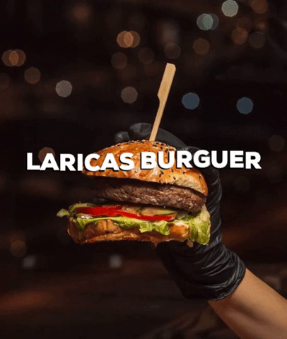
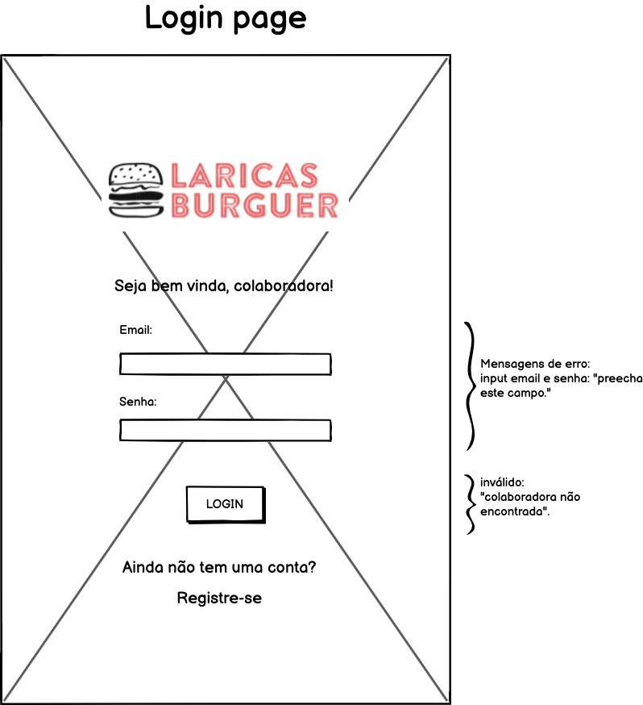
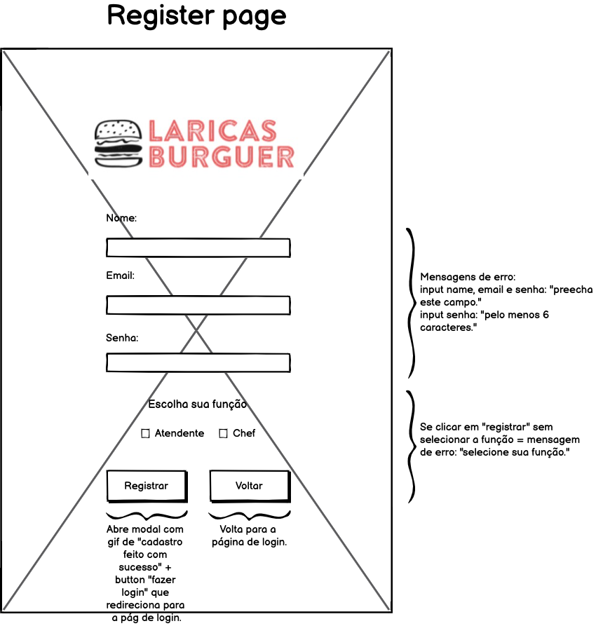
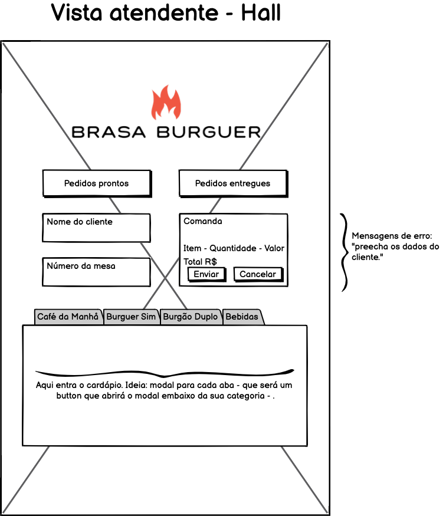
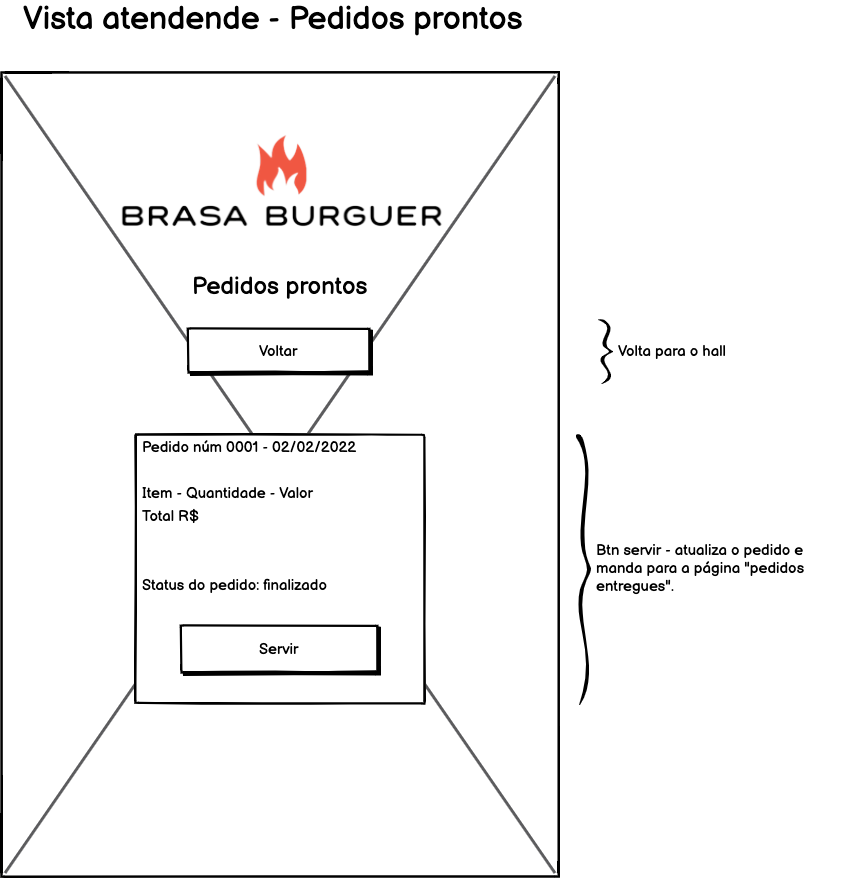
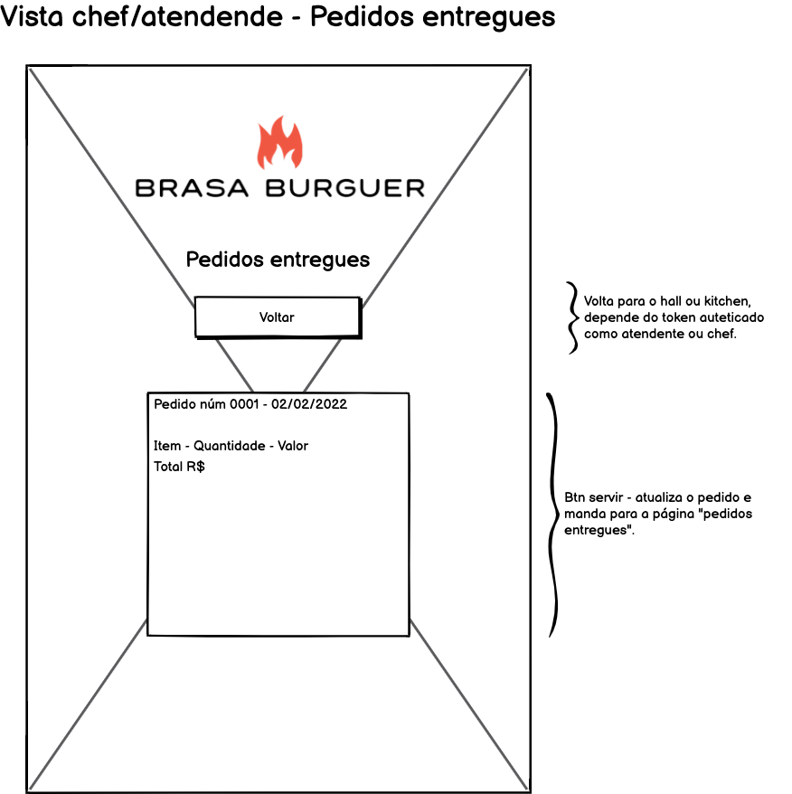
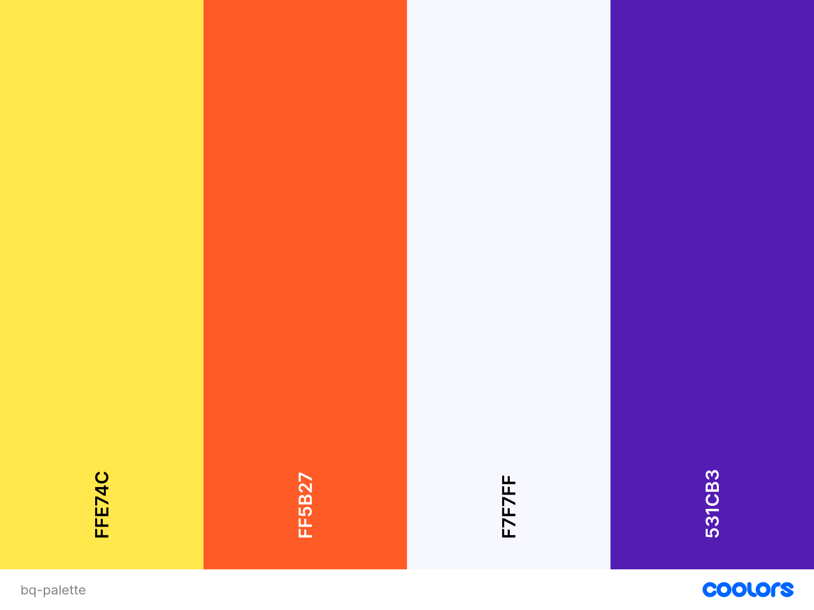

<h1 align="center">Projeto API Client - Burguer Queen</h1>

   

## Índice

- [1. Sobre](#1-sobre)
- [2. Resumo do projeto](#2-resumo-do-projeto)
- [3. Histórias de Usuário](#3-histórias-de-usuário)
- [4. Protótipos](#4-protótipos)
- [5. Objetivos de aprendizagem](#5-objetivos-de-aprendizagem)
- [6. Desenvolvedora](#6-desenvolvedora)

---

## 1. Sobre:

Este projeto foi desenvolvido no Bootcamp Laboratória em 5 sprints, utilizando JavaScript, React, consumo de API externa, CSS e HTML.

Acesso à aplicação <a href="https://">aqui</a>

| Login: atendente - hall | Login: cozinheiro - kitchen |
| :---------------------: | :-------------------------: |
|   E-mail: testeteste    |  E-mail: testeteste |
|       Senha: 0000       |         Senha: 0000         |

## 2. Resumo do projeto

Um pequeno restaurante de hambúrgueres, que está crescendo, necessita uma
interface em que se possa realizar pedidos utilizando um _tablet_, e enviá-los
para a cozinha para que sejam preparados de forma ordenada e eficiente.

- Este projeto tem duas áreas: interface (cliente) e API (servidor). Nosso
  cliente nos pediu para desenvolver uma interface que se integre com a API.

- Desta vez temos um projeto 100% por demanda. Você sempre pode (e deve) fazer
  sugestões de melhora e mudança, mas muitas vezes trabalhará em um projeto em que
  primeiro deve se assegurar de cumprir os requisitos.

Estas são as informações que temos do cliente:

> Somos **Burger Queen**, um fast food 24hrs.
>
> A nossa proposta de serviço 24 horas foi muito bem recebida e, para continuar a
> crescer, precisamos de um sistema que nos ajude a receber pedidos de nossos
> clientes.
>
> Nós temos 2 menus. Um muito simples para o café da manhã:
>
> | Ítem                           | Preço R$ |
> | ------------------------------ | -------- |
> | Café americano                 | 5        |
> | Café com leite                 | 7        |
> | Sanduíche de presunto e queijo | 10       |
> | Suco de fruta natural          | 7        |
>
> E outro menu para o resto do dia:
>
> | Ítem                     | Preço  |
> | ------------------------ | ------ |
> | **Hambúrgueres**         | **R$** |
> | Hambúrguer simples       | 10     |
> | Hambúrguer duplo         | 15     |
> | **Acompanhamentos**      | **R$** |
> | Batata frita             | 5      |
> | Anéis de cebola          | 5      |
> | **Bebidas**              | **R$** |
> | Água 500ml               | 5      |
> | Água 750ml               | 7      |
> | Bebida gaseificada 500ml | 7      |
> | Bebida gaseificada 750ml | 10     |
>
> **Importante:** Os clientes podem escolher entre hambúrgueres de carne bovina,
> frango ou vegetariano. Além disso, por um adicional de R\$ 1,00 , eles podem
> adicionar queijo **ou** ovo.
>
> Nossos clientes são bastante indecisos, por isso é muito comum que eles mudem o
> seu pedido várias vezes antes de finalizar.

- A interface deve mostrar os dois menus (café da manhã e restante do dia), cada
  um com todos os seus _produtos_. O usuário deve poder escolher que _produtos_
  adicionar e a interface deve mostrar o _resumo do pedido_ com o custo total.

- Além disso a cliente nos deu um [link da documentação](https://lab-api-bq.herokuapp.com/api-docs/)
  que especifica o comportamento esperado da API que iremos expor por HTTP.

## 3. Histórias de Usuário

### Definição do produto

O [_Product Owner_](https://www.youtube.com/watch?v=7lhnYbmovb4) nos apresentou
este _backlog_ que é o resultado do seu trabalho com o cliente até hoje.

---

#### [História de usuário 1] Garçom/Garçonete deve poder entrar no sistema

Eu, como garçom/garçonete quero entrar no sistema de pedidos.

##### Critérios de aceitação

O que deve acontecer para satisfazer as necessidades do usuário?

- Acessar uma tela de login.
- Inserir email e senha.
- Receber mensagens de erros compreensíveis, conforme o erro e as informações inseridas.
- Entrar no sistema de pedidos caso as credenciais forem corretas.

##### Definição de pronto

O acordado abaixo deve acontecer para dizer que a história está terminada:

- Você deve ter recebido _code review_ de pelo menos uma parceira.
- Fez _testes_ unitários e, além disso, testou seu produto manualmente.
- Você fez _testes_ de usabilidade e incorporou o _feedback_ do usuário.
- Você deu deploy de seu aplicativo e marcou sua versão (tag git).

---

#### [História de usuário 2] Garçom/Garçonete deve ser capaz de anotar o pedido do cliente

Eu como garçom/garçonete quero poder anotar o pedido de um cliente para não
depender da minha memória, saber quanto cobrar e poder enviar os pedidos para a
cozinha para serem preparados em ordem.

##### Critérios de aceitação

O que deve acontecer para satisfazer as necessidades do usuário?

- Anotar o nome do cliente.
- Adicionar produtos aos pedidos.
- Excluir produtos.
- Ver resumo e o total da compra.
- Enviar o pedido para a cozinha (guardar em algum banco de dados).
- Funcionar bem em um _tablet_.

##### Definição de pronto

O acordado abaixo deve acontecer para dizer que a história está terminada:

- Você deve ter recebido _code review_ de pelo menos uma parceira.
- Fez _testes_ unitários e, além disso, testou seu produto manualmente.
- Você fez _testes_ de usabilidade e incorporou o _feedback_ do usuário.
- Você deu deploy de seu aplicativo e marcou sua versão (tag git).

---

#### [História de usuário 3] Chefe de cozinha deve ver os pedidos

Eu como chefe de cozinha quero ver os pedidos dos clientes em ordem, poder
marcar que estão prontos e poder notificar os garçons/garçonetes que o pedido
está pronto para ser entregue ao cliente.

##### Critérios de aceitação

- Ver os pedidos ordenados à medida em que são feitos.
- Marcar os pedidos que foram preparados e estão prontos para serem servidos.
- Ver o tempo que levou para preparar o pedido desde que chegou, até ser marcado
  como concluído.

##### Definição de pronto

- Você deve ter recebido _code review_ de pelo menos uma parceira.
- Fez _testes_ unitários e, além disso, testou seu produto manualmente.
- Você fez _testes_ de usabilidade e incorporou o _feedback_ do usuário.
- Você deu deploy de seu aplicativo e marcou sua versão (tag git).

---

#### [História de usuário 4] Garçom/Garçonete deve ver os pedidos prontos para servir

Eu como garçom/garçonete quero ver os pedidos que estão prontos para entregá-los
rapidamente aos clientes.

##### Critérios de aceitação

- Ver a lista de pedidos prontos para servir.
- Marcar os pedidos que foram entregues.

##### Definição de pronto

- Você deve ter recebido _code review_ de pelo menos uma parceira.
- Fez _testes_ unitários e, além disso, testou seu produto manualmente.
- Você fez _testes_ de usabilidade e incorporou o _feedback_ do usuário.
- Você deu deploy de seu aplicativo e marcou sua versão (tag git).
- Os dados devem ser mantidos intactos, mesmo depois que um pedido for
  finalizado. Tudo isso para poder ter estatísticas no futuro.

---

## 4.💡 Protótipos

Navegação planejada para Mobile First (Tablets).  
Criado com https://balsamiq.cloud/

#### 🎨 Paleta de cores:

Criada com https://coolors.co/

## 5.📚 Objetivos de aprendizagem

- [ ] **Uso de HTML semântico**

- [ ] **Uso de seletores de CSS**

- [ ] **Empregar o modelo de caixa (box model): borda, margem, preenchimento**

- [ ] **Uso de flexbox en CSS**

- [ ] **Uso de CSS Grid Layout**
- [ ] **Uso de media queries**

- [ ] **Testes unitários**

- [ ] **Testes assíncronos**

- [ ] **Mocking**

- [ ] **Uso ES modules**

- [ ] **Uso de linter (ESLINT)**

- [ ] **Uso de identificadores descritivos (Nomenclatura | Semântica)**

- [ ] **Git: Instalação e configuração**

- [ ] **Git: Controle de versão com git (init, clone, add, commit, status, push, pull, remote)**

- [ ] **Git: Integração de mudanças entre ramos (branch, checkout, fetch, merge, reset, rebase, tag)**

- [ ] **GitHub: Criação de contas e repositórios, configuração de chave SSH**

- [ ] **GitHub: Implantação com GitHub Pages**

- [ ] **GitHub: Colaboração pelo Github (branches | forks | pull requests | code review | tags)**

- [ ] **GitHub: Organização pelo Github (projects | issues | labels | milestones | releases)**

- [ ] **Solicitações o requisições (request) e respostas (response).**

- [ ] **Cabeçalhos (headers)**

- [ ] **Corpo (body)**
- [ ] **Verbos HTTP**

- [ ] **Codigos de status de HTTP**

- [ ] **Encodings e JSON**

- [ ] **CORS (Cross-Origin Resource Sharing)**

- [ ] **jsx**

- [ ] **components**

- [ ] **events**

- [ ] **lists-and-keys**

- [ ] **conditional-rendering**

- [ ] **lifting-up-state**

- [ ] **hooks**

- [ ] **css-modules**

- [ ] **routing**

- [ ] **Desenhar a aplicação pensando e entendendo a usuária**

- [ ] **Criar protótipos para obter feedback e iterar**

- [ ] **Aplicar os princípios de desenho visual (contraste, alinhamento, hierarquia)**

- [ ] **Planejar e executar testes de usabilidade**

## 6. 👩🏽‍💻 Desenvolvedora

Olá! Obrigada pela visita =)  
Sou aluna do bootcamp Laboratória e graduanda em Engenharia de Software.   Fique à vontade para entrar em contato. 🚀

|Layssa Aragão
| ---------------------------
| 
  

| <a href='https://github.com/aragaolala'></img></a> <a href='https://www.linkedin.com/in/layssaaragaob/'></img></a>
